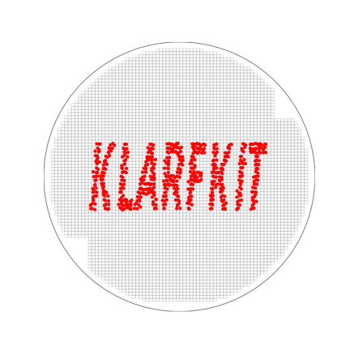

<p align="left">
  
</p>

#### Dealing with particles is hard. klarfkit makes it easier.
[](https://gist.github.com/cheerfulstoic/d107229326a01ff0f333a1d3476e068d)
<!--[](https://badge.fury.io/py/klarfkit)-->


## Introduction

klarfkit can be used to analyze semiconductor wafer maps to locate issues with production or failing parts:

Simply load a klarf file, typically with the extension `.001` into the WaferMap and generate plots from that klarf

### Applications
 - Generate a plot to locate defects caused by process variation
 - Overlay several KLARF defect files into one wafer map to find hidden process issues
 - Color defects on the defect map by time, process, defect class, size, inspector, or any number of KLARF attributes
 - Edit KLARF files by exporting the raw data to CSV or Excel formats and importing the data back into KLARF format
 - Combine several KLARF files together

## Installation
```bash
pip install git+https://github.com/MichaelHotaling/klarfkit.git
```

## Contributing
If you have different file versions, please consider adding them to the `sample_files` folder via *Pull Request*.

Any additional files are very welcome and help to ensure the library works for all KLARF versions.
<!--Please refer to the [Contributing Guide](https://github.com/MichaelHotaling/klarfkit/blob/main/CONTRIBUTING.md) before creating any *Pull Requests*. It will make life easier for everyone.-->

## Documentation and tutorials
[Official documentation](http://klarfkit.readthedocs.io/en/latest/)


## Questions? Comments? Requests?
Please create an issue in the [klarfkit repository](https://github.com/MichaelHotaling/klarfkit/issues).
